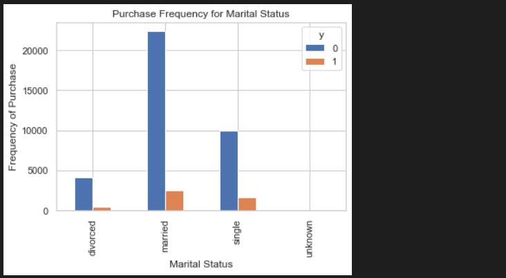

# Logistic Regression in Python (Step by Step)

The dataset comes from the UCI Machine Learning repository, and it is related to direct marketing campaigns (phone calls) of a Portuguese banking institution. The classification goal is to predict whether the client will subscribe (1/0) to a term deposit (variable y).

## Import Libraries

```
# Import Libraries

import numpy as np
import pandas as pd
import matplotlib.pyplot as plt
import seaborn as sns

from sklearn import preprocessing
from sklearn.linear_model import LogisticRegression
from sklearn.model_selection import train_test_split
```

## Take URL of the dataset and load it & Save online dataset to PC

```
# Take URL of the dataset and load it

df = pd.read_csv('https://raw.githubusercontent.com/madmashup/targeted-marketing-predictive-engine/master/banking.csv')

# Save online dataset to PC

df.to_csv('banking.csv')
```

## Load and View Dataset

```
data_set = pd.read_csv('banking.csv', header=0)
data_set = data_set.iloc[:,1:22]
data_set = data_set.dropna()

print(data_set.shape)
print(list(data_set.columns))
```

(41188, 21)

['age', 'job', 'marital', 'education', 'default', 'housing', 'loan', 'contact', 'month', 'day_of_week', 'duration', 'campaign', 'pdays', 'previous', 'poutcome', 'emp_var_rate', 'cons_price_idx', 'cons_conf_idx', 'euribor3m', 'nr_employed', 'y']

```
data_set.head()
```


```
data_set.describe()
```


```
data_set.info()
```


In the dataset 'Education' column has many categories and we need to reduce the categories for a better modelling.
The education column has the following categories:

```
data_set['education'].unique()
```

array(['basic.4y', 'unknown', 'university.degree', 'high.school',
       'basic.9y', 'professional.course', 'basic.6y', 'illiterate'],
      dtype=object)

Now group 'basic.4y', 'basic.9y' and 'basic.6y' together and call them 'basic'.

```data_set['education'] = np.where(data_set['education'] == 'basic.4y', 'basic', data_set['education'])
data_set['education'] = np.where(data_set['education'] == 'basic.6y', 'basic', data_set['education'])
data_set['education'] = np.where(data_set['education'] == 'basic.9y', 'basic', data_set['education'])

data_set['education'].unique()
```

array(['basic', 'unknown', 'university.degree', 'high.school',
       'professional.course', 'illiterate'], dtype=object)

## Data Exploration

##### Set font size and style of plots

```plt.rc("font", size=14)
sns.set(style="white")
sns.set(style="whitegrid", color_codes=True)
```

### Count plot of outcome (y)

```data_set['y'].value_counts()
```


```
sns.countplot(x= 'y', data= data_set, palette='hls')
plt.show()
```


```no_subscribtion_count = len(data_set[data_set['y'] == 0])
subscribtion_count = len(data_set[data_set['y'] == 1])

percentage_of_no_subscribtion = (no_subscribtion_count / (no_subscribtion_count + subscribtion_count))*100
print("percentage of no subscription is %.2f" % percentage_of_no_subscribtion)

percentage_of_subscribtion = (subscribtion_count / (no_subscribtion_count + subscribtion_count))*100
print("percentage of subscription is %.2f" % percentage_of_subscribtion)
```

percentage of no subscription is 88.73

percentage of subscription is 11.27

Our classes are imbalanced, and the ratio of no-subscription to subscription instances is 89:11. Before we go ahead to balance the classes, let’s do some more exploration.

```data_set.groupby('y').mean()
```


**Observations:**

- The average age of customers who bought the term deposit is higher than that of the customers who didn’t.
- The pdays (days since the customer was last contacted) is understandably lower for the customers who bought it. The lower the pdays, the better the memory of the last call and hence the better chances of a sale.
- Surprisingly, campaigns (number of contacts or calls made during the current campaign) are lower for customers who bought the term deposit.

We can calculate categorical means for other categorical variables such as job, education and marital status to get a more detailed sense of our data.

```data_set.groupby('job').mean()
```


```data_set.groupby('marital').mean()
```


```data_set.groupby('education').mean()
```


## Visualizations

- ### job vs Outcome (y)

```table=pd.crosstab(data_set.job,data_set.y)
table.div(table.sum(1).astype(float), axis=0).plot(kind='bar', stacked=True)
plt.title('Stacked Bar Chart of Job Title vs Purchase')
plt.xlabel('Job')
plt.ylabel('Proportion of Customers')
```


```pd.crosstab(data_set.job,data_set.y).plot(kind='bar')
plt.title('Purchase Frequency for Job Title')
plt.xlabel('Job')
plt.ylabel('Frequency of Purchase')
```


- ### marital vs Outcome (y)

```table=pd.crosstab(data_set.marital,data_set.y)
table.div(table.sum(1).astype(float), axis=0).plot(kind='bar', stacked=True)
plt.title('Stacked Bar Chart of Marital Status vs Purchase')
plt.xlabel('Marital Status')
plt.ylabel('Proportion of Customers')
```


```pd.crosstab(data_set.marital,data_set.y).plot(kind='bar')
plt.title('Purchase Frequency for Marital Status')
plt.xlabel('Marital Status')
plt.ylabel('Frequency of Purchase')
```



- ### education vs Outcome (y)

```table=pd.crosstab(data_set.education,data_set.y)
table.div(table.sum(1).astype(float), axis=0).plot(kind='bar', stacked=True)
plt.title('Stacked Bar Chart of Education vs Purchase')
plt.xlabel('Education')
plt.ylabel('Proportion of Customers')
```


```pd.crosstab(data_set.education,data_set.y).plot(kind='bar')
plt.title('Purchase Frequency for Education')
plt.xlabel('Education')
plt.ylabel('Frequency of Purchase')
```


- ### Day of Week vs Outcome (y)

```pd.crosstab(data_set.day_of_week,data_set.y).plot(kind='bar')
plt.title('Purchase Frequency for Day of Week')
plt.xlabel('Day of Week')
plt.ylabel('Frequency of Purchase')
```


- ### Month vs Outcome (y)

```pd.crosstab(data_set.month,data_set.y).plot(kind='bar')
plt.title('Purchase Frequency for Month')
plt.xlabel('Month')
plt.ylabel('Frequency of Purchase')
```


- ### Histogram of Age

```data_set.age.hist()
plt.title('Histogram of Age')
plt.xlabel('Age')
plt.ylabel('Frequency')
```


- ### poutcome vs Outcome (y)

```pd.crosstab(data_set.poutcome,data_set.y).plot(kind='bar')
plt.title('Purchase Frequency for Poutcome')
plt.xlabel('Poutcome')
plt.ylabel('Frequency of Purchase')
```


## Create Dummy Variables

```
data_set['poutcome'].unique()
```

array(['nonexistent', 'success', 'failure'], dtype=object)

### Get dummy variables for 'poutcome' :

```
# get dummy variables for 'poutcome' :
category_list = pd.get_dummies(data_set['poutcome'], prefix='poutcome')
category_list.head()
```


### Join dummy variables (category_list) to the dateset:

```
# join dummy variables (category_list) to the dateset:
data = data_set.join(category_list)
data.head()
```

### Exclude all the categorical variables from the dataset:

```
# exclude all the categorical variables from the dataset:
category_variables=['job','marital','education','default','housing','loan','contact','month','day_of_week','poutcome']
data_variables=data.columns.values.tolist()
to_keep=[i for i in data_variables if i not in category_variables]
data_final = data[to_keep]
```

```
data_final.columns.values
```

array(['age', 'duration', 'campaign', 'pdays', 'previous', 'emp_var_rate',
       'cons_price_idx', 'cons_conf_idx', 'euribor3m', 'nr_employed', 'y',
       'poutcome_failure', 'poutcome_nonexistent', 'poutcome_success'],
      dtype=object)

## Over-sampling using SMOTE (Synthetic Minority Over-sampling Technique)

```
X = data_final.iloc[:,data_final.columns != 'y']
y = data_final.iloc[:,data_final.columns == 'y']

# Import SMOTE Function :
from imblearn.over_sampling import SMOTE

over_sample = SMOTE(random_state=0)

X_train, X_test, y_train, y_test = train_test_split(X, y, test_size=0.2, random_state=0)

X_train_sm, y_train_sm = over_sample.fit_resample(X_train, y_train)

columns = X_train.columns
oversampling_data_X = pd.DataFrame(data=X_train_sm, columns=columns)
oversampling_data_y = pd.DataFrame(data=y_train_sm, columns=['y'])

# we can Check the numbers of our data :
print("length of oversampled data is ",len(oversampling_data_X))
print("Number of no subscription in oversampled data",len(oversampling_data_y[oversampling_data_y['y']==0]))
print("Number of subscription",len(oversampling_data_y[oversampling_data_y['y']==1]))
print("Proportion of no subscription data in oversampled data is ",len(oversampling_data_y[oversampling_data_y['y']==0])/len(oversampling_data_X))
print("Proportion of subscription data in oversampled data is ",len(oversampling_data_y[oversampling_data_y['y']==1])/len(oversampling_data_X))
```

length of oversampled data is  58446

Number of no subscription in oversampled data 29223

Number of subscription 29223

Proportion of no subscription data in oversampled data is  0.5

Proportion of subscription data in oversampled data is  0.5

---  
  Now we have a perfect balanced data! You may have noticed that I over-sampled only on the training data, because by oversampling only on the training data, none of the information in the test data is being used to create synthetic observations, therefore, no information will bleed from test data into the model training.

  ---

  ## Recursive Feature Elimination (RFE)

  RFE is based on the idea to repeatedly construct a model and choose either the best feature. Then setting the feature aside and then repeating the process with the rest of the features. This process is applied until all features in the dataset are exhausted.

```
 from sklearn.feature_selection import RFE
from sklearn.linear_model import LogisticRegression

reg_model = LogisticRegression()

rfe_model = RFE(reg_model, n_features_to_select=5)
rfe = rfe_model.fit(oversampling_data_X, oversampling_data_y) 
```

```
print(rfe.support_)
```

[False False  True False False False False False  True False  True  True
  True]

```
print(rfe.ranking_)
```

[8 7 1 9 3 4 2 5 1 6 1 1 1]

```
oversampling_data_X.columns
```

Index(['age', 'duration', 'campaign', 'pdays', 'previous', 'emp_var_rate',
       'cons_price_idx', 'cons_conf_idx', 'euribor3m', 'nr_employed',
       'poutcome_failure', 'poutcome_nonexistent', 'poutcome_success'],
      dtype='object')

```
# Now Choose the True Columns

cols = ['campaign','euribor3m','poutcome_failure', 'poutcome_nonexistent', 'poutcome_success']

X = oversampling_data_X[cols]
y = oversampling_data_y['y']
```

## Implementing the model

```
import statsmodels.api as sm
logit_model=sm.Logit(y,X)
result=logit_model.fit()
print(result.summary2())
```


## Logistic Regression Model Fitting

```
from sklearn import metrics
from sklearn.linear_model import LogisticRegression

X_train, X_test, y_train, y_test = train_test_split(X, y, test_size=0.2, random_state=0)

reg_model = LogisticRegression()
model = reg_model.fit(X_train, y_train)

y_pred = model.predict(X_test)

accuracy = model.score(X_test, y_test)*100
print('Accuracy of Logistic Regression Classifier is: {:.0f}%'.format(accuracy))
```

Accuracy of Logistic Regression Classifier is: 75%

## Confusion Matrix

```
from sklearn.metrics import confusion_matrix

cm = confusion_matrix(y_test, y_pred)
print(cm)
```


```
plt.figure(figsize=(9,9))

sns.heatmap(cm, annot=True, fmt="-3f", linewidth=0.5, square=True, cmap="Spectral")
plt.xlabel("Actual Output")
plt.ylabel("Predicted Output")
```


Result is telling us that we have (4744 + 3990) 8734 correct predictions and (1875 + 3990) 5865 incorrect predictions.

## Compute precision, recall, F-measure and support

```
from sklearn.metrics import classification_report
print(classification_report(y_test, y_pred))
```


## ROC Curve

```
from sklearn.metrics import roc_auc_score
from sklearn.metrics import roc_curve

logreg_roc_auc = roc_auc_score(y_test, y_pred)
logreg_roc_auc

fpr, tpr, threshold = roc_curve(y_test, model.predict_proba(X_test)[:,1])
fpr, tpr, threshold
```

```
plt.figure(figsize=(8,8))

plt.plot(fpr, tpr, label='Logistic Regression (area = %2f' % logreg_roc_auc)

plt.plot([0, 1], [0, 1], 'r--')

plt.xlim([-0.05, 1.0])
plt.ylim([0.0, 1.05])

plt.xlabel("False Positive Rate")
plt.ylabel("True Positive Rate")
plt.title("Receiver Operating Characteristic")
plt.legend(loc="lower right")
plt.show()
```


The receiver operating characteristic (ROC) curve is another common tool used with binary classifiers. The dotted line represents the ROC curve of a purely random classifier; a good classifier stays as far away from that line as possible (toward the top-left corner).

